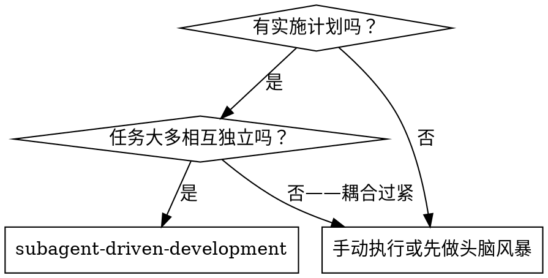
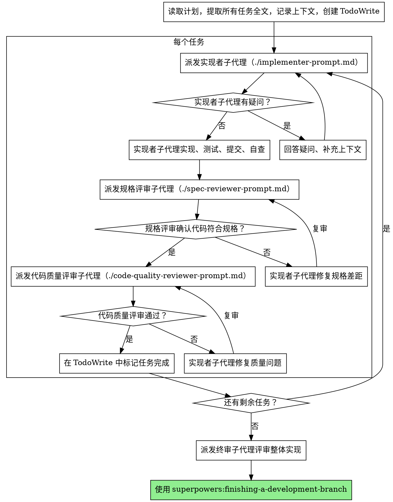

# 子代理驱动开发（Subagent-Driven Development）

按任务逐个派发全新子代理来执行计划,每个任务完成后进行两阶段评审:先做规格符合性评审,再做代码质量评审。

**为什么用子代理:** 你把任务委派给拥有隔离上下文的专职代理。通过精确构造它们的指令和上下文,确保它们保持专注并完成任务。它们绝不应继承你会话中的上下文或历史——你只构造它们所需的内容。这同时也为你自己保留了用于协调工作的上下文。

**核心原则:** 每个任务派发全新子代理 + 两阶段评审(先规格后质量)= 高质量、快迭代

**连续执行:** 任务之间不要停下来向人类伙伴确认。不间断地执行计划中的所有任务。只有三种情况才停:遇到无法解决的 BLOCKED 状态、存在真正阻碍进展的歧义、或所有任务已完成。"要继续吗?"之类的询问和进度汇报只会浪费对方时间——既然要求你执行计划,那就执行它。

## 何时使用



**关键特性:**

- 同一会话(无上下文切换)
- 每个任务派发全新子代理(无上下文污染)
- 每个任务完成后两阶段评审:先规格符合性,再代码质量
- 迭代更快(任务之间无需人工介入)

## 执行流程



## 模型选择

为每个角色选用能胜任的最低配模型,以节省成本、提升速度。

**机械性实现任务**(孤立函数、规格清晰、涉及 1-2 个文件):用快速廉价的模型。只要计划写得足够明确,大多数实现任务都是机械性的。

**集成与判断类任务**(多文件协调、模式匹配、调试):用标准模型。

**架构、设计与评审类任务**:用可用的最强模型。

**任务复杂度信号:**

- 只动 1-2 个文件且规格完整 → 廉价模型
- 涉及多文件且有集成顾虑 → 标准模型
- 需要设计判断或对代码库的全局理解 → 最强模型

## 处理实现者状态

实现者子代理会报告四种状态之一,分别应对:

**DONE(完成):** 进入规格符合性评审。

**DONE_WITH_CONCERNS(完成但有顾虑):** 实现者完成了工作但提出了疑虑。继续之前先读完这些顾虑。若顾虑涉及正确性或范围,先解决再评审;若只是观察性意见(如"这个文件越来越大了"),记录下来后继续评审。

**NEEDS_CONTEXT(需要上下文):** 实现者缺少必要信息。补充缺失的上下文后重新派发。

**BLOCKED(受阻):** 实现者无法完成任务。评估阻塞原因:

1. 若是上下文问题,补充上下文后用同一模型重新派发
2. 若任务需要更强推理,换更强的模型重新派发
3. 若任务过大,拆成更小的任务
4. 若计划本身有误,升级给人类处理

**绝不**忽视升级请求,也绝不在不做任何改变的情况下强迫同一模型重试。实现者说卡住了,就必须改变点什么。

## 提示词模板

- `./implementer-prompt.md` - 派发实现者子代理
- `./spec-reviewer-prompt.md` - 派发规格符合性评审子代理
- `./code-quality-reviewer-prompt.md` - 派发代码质量评审子代理

## 示例工作流

```
你：我将使用子代理驱动开发来执行这份计划。

[读取计划文件一次：docs/feature-plan.md]
[提取全部 5 个任务的完整文本和上下文]
[用所有任务创建 TodoWrite]

任务 1：Hook 安装脚本

[取出任务 1 的文本和上下文（已提前提取）]
[携带任务全文 + 上下文派发实现子代理]

实现者："开始前想确认——hook 装在用户级还是系统级？"

你："用户级（~/.config/superpowers/hooks/）"

实现者："明白，开始实现……"
[稍后] 实现者：
  - 实现了 install-hook 命令
  - 补了测试，5/5 通过
  - 自查：发现漏了 --force 参数，已补上
  - 已提交

[派发规格符合性评审]
规格评审：✅ 符合规格——所有要求都满足，没有多余实现

[获取 git SHA，派发代码质量评审]
质量评审：优点：测试覆盖好、代码干净。问题：无。通过。

[标记任务 1 完成]

任务 2：恢复模式

[取出任务 2 的文本和上下文（已提前提取）]
[携带任务全文 + 上下文派发实现子代理]

实现者：[无疑问，直接开工]
实现者：
  - 添加了 verify/repair 两种模式
  - 8/8 测试通过
  - 自查：没有问题
  - 已提交

[派发规格符合性评审]
规格评审：❌ 问题：
  - 缺失：进度上报（规格要求"每 100 条上报一次"）
  - 多余：加了 --json 参数（需求里没有）

[实现者修复问题]
实现者：移除了 --json 参数，补上了进度上报

[规格评审复审]
规格评审：✅ 现在符合规格了

[派发代码质量评审]
质量评审：优点：扎实。问题（重要）：魔法数字（100）

[实现者修复]
实现者：提取了 PROGRESS_INTERVAL 常量

[质量评审复审]
质量评审：✅ 通过

[标记任务 2 完成]

……

[所有任务完成后]
[派发终审 code-reviewer]
终审：所有需求均满足，可以合并

完成！
```

## 优势

**对比手动执行:**

- 子代理天然遵循 TDD
- 每个任务上下文全新(不会混乱)
- 并行安全(子代理互不干扰)
- 子代理可以提问(开工前和过程中都可以)
- 同一会话(无交接成本)
- 持续推进(无等待)
- 评审检查点自动执行

**效率收益:**

- 无读文件开销(控制者直接提供任务全文)
- 控制者精确筛选所需上下文
- 子代理开工前就拿到完整信息
- 疑问在开工前暴露(而不是干完才发现)

**质量关卡:**

- 自查在交接前就发现问题
- 两阶段评审:先规格符合性,再代码质量
- 评审循环确保修复真正生效
- 规格评审防止过度实现/实现不足
- 质量评审确保实现本身足够好

**成本:**

- 子代理调用次数更多(每任务 1 实现者 + 2 评审者)
- 控制者准备工作更多(需提前提取所有任务)
- 评审循环增加迭代次数
- 但问题发现得早(比事后调试便宜)

## 红线

**绝不:**

- 未经用户明确同意就在 main/master 分支上直接开工
- 跳过评审(规格符合性或代码质量任何一个)
- 带着未修复的问题继续推进
- 并行派发多个实现子代理(会冲突)
- 让子代理自己去读计划文件(应直接提供全文)
- 省略场景铺垫上下文(子代理需要理解任务在整体中的位置)
- 无视子代理的提问(必须先回答再让它继续)
- 在规格符合性上接受"差不多就行"(规格评审发现问题 = 没完成)
- 跳过评审循环(评审发现问题 = 实现者修复 = 再评审)
- 用实现者自查替代正式评审(两者都不可少)
- **规格符合性未通过 ✅ 就开始代码质量评审**(顺序错误)
- 任一评审还有未关闭问题时就进入下一个任务

**当子代理提问时:**

- 清晰、完整地回答
- 必要时补充更多上下文
- 不要催促它匆忙开工

**当评审发现问题时:**

- 实现者(同一个子代理)负责修复
- 评审者再次评审
- 重复直到通过
- 不要跳过复审

**当子代理任务失败时:**

- 派发修复子代理并给出具体指令
- 不要亲自动手修(会污染上下文)

## 集成

**必需的工作流技能:**

- **superpowers:using-git-worktrees** - 确保有隔离工作区(新建或校验已有)
- **superpowers:writing-plans** - 产出本技能要执行的计划
- **superpowers:requesting-code-review** - 评审子代理使用的代码评审模板
- **superpowers:finishing-a-development-branch** - 所有任务完成后的收尾

**子代理应使用:**

- **superpowers:test-driven-development** - 子代理对每个任务遵循 TDD
